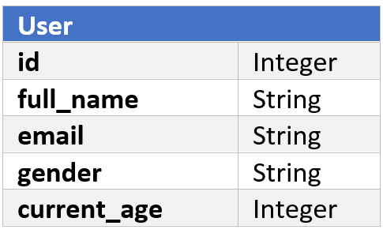

# Mini Database

## Introduction

There are many types of databases that are used around the world to hold and grab data; some popular types are **SQL, NoSQL**, and **Graph**.
Each of them keeps data differently; for example, SQLs hold data in **tables**, NoSQLs in** collections**, and Graphs in **nodes, edges**. They might store the data as **files in a hard drive**, as **objects in RAM** or **both**.
Your task is to implement a **minimal SQL-like database which stores data as files in hard drive.**

## Definitions

### Database Table
Just like a regular table, it consists of **columns (fields)** and **rows (objects)** where columns show the structure of the table, and each row is a piece of information that conforms to that structure. Each column has a **name**, a **type**, and a **fixed size**, and at least one of these columns must be a [primary key](#primary-key).

A table is similar to a **class** in Object-Oriented programming where each column is a field of that class, and each row is an object of it.

### Primary Key

A primary key of each table is a specific **column** that **uniquely** identifies each row. It is usually an **incremental integer**; for example, the primary key of the first row of the table will be 1, the second row will be 2, and so on.

### Schema
the schema contains The definition of the columns of each table. Mainly, it defines the **name, type**, and **size** of each column; for example, a "User" table with columns "id" of type Integer (4 bytes), "full_name" of type String (100 bytes or characters), "email" of type String (100 bytes or characters), "gender" of type String (10 bytes or characters) and "current_age" of type Integer (4 bytes).
The schema of a table, as a result, can also show the size of **rows** of a table (by adding up all the column sizes); for example, the size of the rows of the table above will be 4 + 100 + 100 + 10 + 4 = 218 bytes.
A visual example of this schema is shown in figure 1. A sample of the resulting table of this example schema is shown in figure 2.

<table>
  <tr>
    <td>
      
    </td>
    <td>
      
    </td>
  </tr>
  <tr>
    <td>
      Figure 1
    </td>
    <td>
      Figure 2
    </td>
  </tr>
</table>

## Components

Your program needs to have the following components:

### Engine

The central part of your database, also called the engine, must be able to create tables with a specific schema and `insert`, `update`, `delete`, and `search` data in a particular table.
It should create a file schemas to store each table's schema. The way you're going to store the schemas in the file is up to you.

#### Functionality Details

* `create`:
It should receive a table name and a schema definition, and do the following things:

  1) Save the schema in the `schema` file,

  2) Create a folder with the name of the table and creating two files inside the folder, `DB` and `index`. These files will be explained later.

* `insert`:
It should receive a table name and some data, and should do the following things:

  1) Validate that the given data conforms to the table schema,

  2) Serialize and insert the given data in the first empty row of `DB` file of the table folder, or at the end if none exists.
     It should write the data **sequentially**; so for example, in the `DB` file of the example table above, the first 218 bytes will be the first row, the second 218 bytes will be the second row and so on.
     Note that all rows of a table have the same size (sum of column sizes).

     * For better performance, in Windows, you can use split the `DB` file by a fixed maximum size, and save the name of the file which a row is stored in, in the `index` file.

  3) In `index` file of the table folder, write **the primary key of the row** and **the exact position of it's data in the `DB` file**.

     This file is required because without it, you will need to iterate over all of the `DB` file for each command, and this would be a bad idea if we had many data instead we can quickly iterate over small index file very fast, and in the situation that we have much memory even we can cache it in memory in a charming data structure like a red and black tree.

* `update`:
It should receive a **table name**, a **primary key** and **some data**, and should do the following things:

  1) Validate that the given data conforms to the table schema,

  2) Find the position of data in DB file, by the given primary key in the `index` file,

  3) Update the row with the given data.

* `delete`:
It should receive a **table name** and a **primary key**, and should do the following things:

  1) Find the position of data in `DB` file, by the given primary key in the `index` file

  2) Replace the whole data of that row with the buffer of zeros by the size of `schema`,

  3) Delete the index information of that row from the `index` file.
     
     *Note that `create` must try to fill these holes in the file with new rows whenever possible, so that may keep a reference of these empty blocks is a good idea for better performance.

* `search`:
It should receive a **table name** and a **range** or an **array of primary keys**, and should do the following things:

  1) Find the positions of data in `DB` file, by the given primary key in the Index file

  2) Deserialize data and return it.

### User Interface

just receive commands and print results
Commands are **JSON strings**, so your program needs to parse JSON to understand what the user wants.

Different types of commands are described below:

#### Schema
The user gives a **table name** and a **schema definition** and expects **a table with the given name and schema** to be created, and the status message printed

#### Insert [*](#footnote1)
The user gives a **table name** and **some data** and expects **one object** with the given data to be created in that table, and the status message printed

#### Update [*](#footnote1)
The user gives a **table name**, a **primary key**, and **some data** and expects **one object** of that table, which has the given primary key, to be updated with the given data, and the status message printed

#### Delete
The user gives a **table name** and a **primary key** and expects **one object** of that table, which has the given primary key, to be deleted.

#### Search
The user gives a table name and range or an array of **primary keys**
If given a primary key, the user expects *one object of that table, which has the given primary key, to be printed in the terminal in a **JSON object** format.

* If the given data did not conform to the table schema, you should print an appropriate error in the terminal.
** **you must document your used commands**.

## Submission Details

This exercise consists of **two phases**, each with their own deadline, and you should submit different components of this task in each of them.

### Phase 1:
  - Serialization and deserialization method
  - Entity validation
  - Insert data
  - Search data

### Phase 2:
  - update data
  - delete data
  - JSON serialization and deserialization utility
  - Command documentation
  - Integrate user interface with the engine

## ⏳ Deadline

### Phase 1
May 12th, 2020

### Phase 2
May 16th, 2020

## Bonus Task

* The `search` functionality may receive a column name **other than the primary key** and a value, and return **all** the objects which have the given value for the given column name.
